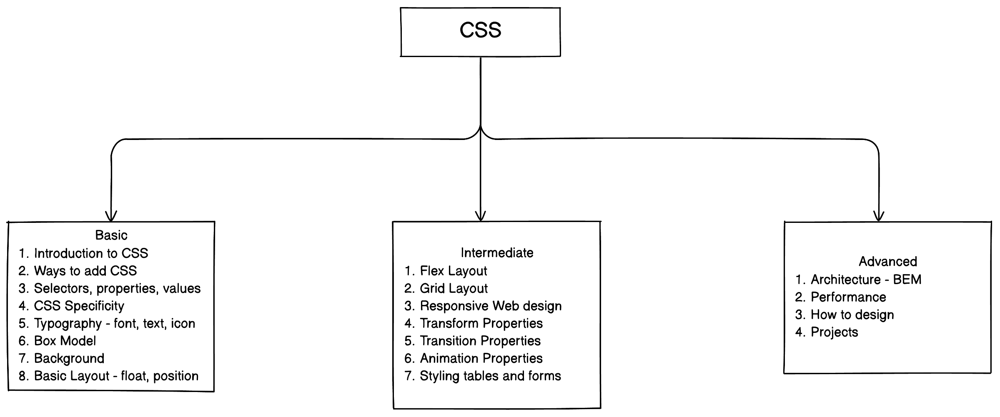
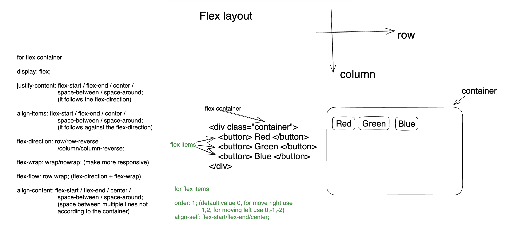

# CSS Documentation

- [CSS Full Course with a project | Zero to Hero | English Tutorial](https://youtu.be/lXYo52yFLDk)
- [CSS complete course Bangla (Beginner to Advanced)](https://youtube.com/playlist?list=PLgH5QX0i9K3qjCBXjTmv7Xeh8MDUUVJDO)
- [CSS eCommerce Project Bangla](https://youtube.com/playlist?list=PLgH5QX0i9K3rsTE0J6lv99JsJHlPlIvSC)



## Table of Contents

1. [Basic CSS](#1-basic-css)

   - [Introduction to CSS](#11-introduction-to-css)
   - [Ways to add CSS](#12-ways-to-add-css)
   - [Selectors & combinators](#13-selectors--combinators)
   - [CSS Specificity](#14-css-specificity)
   - [Typography](#15-typography)
   - [Box Model](#16-box-model)
     - [box-sizing, opacity, overflow, Visibility](#162-box-sizing-opacity-overflow-visibility)
     - [display-properties](#163-display-properties)
   - [background properties](#17-background-properties)
   - [Basic Layout](#18-basic-layout)
     - [Float](#181-float)
     - [Positioning](#182-position)
     - [z-index & css variables](#183-z-index--css-variables)
     - [text-shadow and box-shadow](#184-text-shadow-and-box-shadow)
     - [design a card](#185-card-design)

2. [Intermediate CSS](#2-intermediate-css)
   - [Flex Layout](#21-flexbox-layout)
   - [Grid Layout](#22-grid-layout)
   - [Responsive Web design](#23-responsive-web-design-rwd)
   - [Transform Properties](#24-transform-property)
   - [Transition Properties](#25-transition-property)
   - [Animation Properties](#26-animation-property)
   - [Styling tables and forms](#27-styling-tables-and-forms)
3. [Advanced CSS](#3-advanced-css)

   - [CSS Architecture](#31-css-architecture-bem-methodology)
   - [Performance Optimization](#32-performance-optimization)
   - [How to design](#33-how-to-design)
   - [Projects](#34-projects)
     <!-- - [CV Project](#341-cv-project)
     - [Calculator Project](#342-calculator-project)
     - [Portfolio Website](#343-portfolio-project)
     - [Restaurant Website](#344-restaurant-project)
     - [Blog Website](#345-blog-website-project)
     - [Ecommerce Website](#346-e-commerce-website-project) -->

   - [Challenges](#35-challenge)

## 1. Basic CSS

### 1.1 Introduction to CSS

- CSS stands for Cascading Style Sheets
- It is used to style **html elements**
- Initial release on December 17, 1996

### 1.2 Ways to Add CSS

- 3 main ways to add css with html: Inline CSS, Internal CSS, External CSS

#### Inline CSS

- Inline CSS refers to style inside html element. Syntax: `<tagName style="property:value; property:value; ... ">`
- Inline CSS Example is given below:

  ```html
  <h1 style="background-color: green">Welcome to CSS</h1>
  <p style="color: white; background-color: green">
    aperiam fugiat blanditiis voluptatibus quo!
  </p>
  <p style="color: white; background-color: green">
    aperiam fugiat blanditiis voluptatibus quo!
  </p>
  ```

#### Internal CSS

- Inside `<head>` tag we can use internal css with the help of `<style>` tag
- Internal CSS Syntax:

  ```html
  <style>
    selector {
      property: value;
      property: value;
      ...;
    }
  </style>
  ```

- Internal CSS Example is given below; In the example `<p>` tag is a selector:

  ```html
  <!DOCTYPE html>
  <html lang="en">
    <head>
      <title>Learn Internal CSS</title>
      <style>
        p {
          background-color: green;
          color: white;
        }
      </>
    </head>
    <body>
      <p>Welcome to CSS</p>
      <p>aperiam fugiat blanditiis voluptatibus quo!</p>
    </body>
  </html>
  ```

#### Exetrnal CSS

- Inside `<head>` tag we can link the external css file with the help of `<link rel="stylesheet" href="cssFileNameOrAddressHere"/> tag`
- create a css file with an extension of .css as shown below: style.css

  ```css
  p {
    background-color: green;
    color: white;
  }
  ```

- then add the css file inside html file as shown below:

  ```html
  <head>
    <title>Learn Internal CSS</title>
    <link rel="stylesheet" href="style.css" />
  </head>
  <body>
    <p>Welcome to CSS</p>
    <p>aperiam fugiat blanditiis voluptatibus quo!</p>
  </body>
  ```

### 1.3 Selectors & Combinators

- Basic Selectors: Element Selector, grouping selectors, nested selector, Universal Selector, ID selectors, class selectors,
- Element selector: select an element by using its name.  
  Example:

  ```html
  <head>
    <style>
      h1 {
        background-color: green;
      }
    </style>
  </head>
  <body>
    <h1>Bangladesh</h1>
  </body>
  ```

- Grouping selector: select multiple element by using their names separted with comma.  
  Example:

  ```html
  <head>
    <style>
      h1,
      h2,
      p {
        background-color: green;
      }
    </style>
  </head>
  <body>
    <h1>Bangladesh</h1>
    <h2>Bangladesh</h2>
    <p>Bangladesh</p>
  </body>
  ```

- Nested selector: select elements by nesting. ul li a {...}, div p {...}
  Example:

  ```html
  <!DOCTYPE html>
  <html lang="en">
    <head>
      <title>Learn Internal CSS</title>
      <style>
        ul li a {
          color: green;
        }
      </style>
    </head>
    <body>
      <ul>
        <li><a href="#">Google</a></li>
      </ul>
    </body>
  </html>
  ```

- Universal selector can help to select all the html elements. It is denoted by \*  
  Example:

  ```html
  <!DOCTYPE html>
  <html lang="en">
    <head>
      <title>Learn Internal CSS</title>
      <style>
        * {
          background-color: salmon;
          color: white;
        }
      </style>
    </head>
    <body>
      <h1>Hello CSS</h1>
      <p>aperiam fugiat blanditiis voluptatibus quo!</p>
    </body>
  </html>
  ```

- id selector: is unique inside html document. #id can help to select any element with a given id. use # notation for selecting an id.
  Example:

  ```html
  <head>
    <style>
      #title {
        background-color: green;
      }
    </style>
  </head>
  <body>
    <h1 id="title">Bangladesh</h1>
  </body>
  ```

- class selector: .class can help to select any element with a given class. use dot notation for selecting a class.
  Example:

  ```html
  <head>
    <style>
      .title {
        background-color: green;
      }
    </style>
  </head>
  <body>
    <h1 class="title">Bangladesh</h1>
  </body>
  ```

  - we can use multiple class name for an html element such as `<h1 class="style1 style2" > this is something </h1>`
  - selecting elements with class name, id name example is given below:

    ```html
    <!DOCTYPE html>
    <html lang="en">
      <head>
        <title>Learn Internal CSS</title>
        <style>
          .heading h1 {
            background-color: salmon;
            color: white;
          }
          #heading2 p {
            background-color: green;
            color: white;
          }
        </style>
      </head>
      <body>
        <div class="heading">
          <h1>Hello CSS</h1>
          <p>aperiam fugiat blanditiis voluptatibus quo!</p>
        </div>
        <div id="heading2">
          <h1>Hello CSS</h1>
          <p>aperiam fugiat blanditiis voluptatibus quo!</p>
        </div>
      </body>
    </html>
    ```

- Attribute selectors

  - [References](https://developer.mozilla.org/en-US/docs/Web/CSS/Attribute_selectors)
  - syntax for Attribute selectors

    ```css
    /*for attribute name attr.*/
    element[attr] {
      property: value;
    }

    /*for attribute name attr with exactly same value.*/
    element[attr='value'] {
      property: value;
    }

    /* element with "value" anywhere in the url.*/
    element[attr*='value'] {
      property: value;
    }

    /* element with "value" anywhere in the url without case sensitivity.*/
    element[attr*='value' i] {
      property: value;
    }

    /* element end with .value; mainly for link(a) tag.*/
    element[attr$='.value'] {
      property: value;
    }
    ```

- Pseudo class selectors

  - Link Pseudo classes: link, visited, hover, active
  - Input Pseudo classes: focus, enabled, disabled, checked, required, optional, valid, invalid
  - General Pseudo classes: first-child, last-child, first-of-type, last-of-type, nth-child(n), nth-last-child(n), nth-last-of-type(n), root, not
  - [References](https://developer.mozilla.org/en-US/docs/Web/CSS/Pseudo-classes)
  - syntax for Pseudo class selectors

    ```css
    selector:pseudo-class {
      property: value;
    }
    ```

- Pseudo element selectors

  - Common Pseudo element: after, before, first-letter, first-line, placeholder, select
  - [References](https://developer.mozilla.org/en-US/docs/Web/CSS/Pseudo-elements)
  - syntax for Pseudo element selectors

    ```css
    selector::pseudo-element {
    property: value;
    }
    -- Child selectors (div > p)
    ```

- descendent selectors (div p)
- adjacent selectors (div + p)
- general sibling selectors (div ~ p)

### 1.4 CSS Specificity

- [References](https://www.w3.org/TR/selectors-3/#specificity)

  - [specificity calculator](https://specificity.keegan.st/)

- How to calculate specificity

  - Universal selector (\*) specificity - 0
  - Count the number of Elements and Pesudo elements (c) - 1
  - Count the number of Classes, attributes, Pseudo classes (b) - 10
  - Count the number of IDs (a) - 100
  - Inline CSS - 1000
  - !important - 10000

  ```css
  /* specificity calculator */
  /* a=number of id  */
  /* b=number of class, pseduo classes, attributes  */
  /* b=number of elements, pesudo elemnts, attributes  */

  /* a=0 b=0 c=1 === 001 */
  h1 {
    background-color: grey;
  }

  /* a=0 b=1 c=1  === 011 */
  h1.heading {
    background-color: blue;
  }

  /* a=0 b=1 c=0  === 010 */
  .heading {
    background-color: green;
  }

  /* a=1 b=1 c=0  === 100 */
  #head {
    background-color: red;
  }

  /* a=1 b=0 c=1  === 101 */
  h1#head {
    background-color: pink;
  }

  /* a=1 b=1 c=1  === 111 */
  h1#head.heading {
    background-color: brown;
  }
  ```

### 1.5 Typography

#### Font Properties

- `font-size: value;` here value can be px/em/rem. 1rem=16px=100%
- `font-weight: value;` here value can be 100/thin, 200/extra light, 300/light, 400/normal, 500/medium, 600/semi-medium, 700/bold, 800/extra bold, 900/black
- `font-style: value;` here value can be italic/normal/oblique
- `font-family: value;` here value can be any valid font name. In the following example paragaph will have Times New Roman as its font; if Times New Roman is not available then Times will be applied and if Times is not available then serif font will be applied. This process is known as fallback.

  ```css
  p {
    font-size: 2rem;
    font-weight: bold;
    font-style: italic;
    font-family: 'Times New Roman', Times, serif;
  }
  ```

- [Use google font](https://fonts.google.com/)

#### How to use Color

- Syntax: `color: value;` here value can be any color names, hexadcimal colors value, RGB(Red, Green, Blue) color value, hsl (Hue, Saturation, Lightness) value
- Color Name: we can use color names directly as shown below:

  ```css
  p {
    color: green;
  }
  ```

- RGB: we can use Red, Green, Blue values as shown below:

  ```css
  p {
    color: rgb(0, 255, 0);
  }
  ```

- Hexadecimal color: It is a code consist of 6 characters where first 2 characters for Red, Next 2 for Green and last 2 characters for Blue. Example is given below:

  ```css
  p {
    color: #00ff00;
    /*we can write one value instead of two similar values*/
    color: #0f0;
  }
  ```

- Important Tools:
  - [Canva color wheel](https://www.canva.com/colors/color-wheel/)
  - [Color Picker](https://htmlcolorcodes.com/color-picker/)
  - [Image color picker](https://imagecolorpicker.com/en)
  - https://flatuicolors.com/

#### Text styling

- `text-align: value;` here value can be center / left / right / justify
- `text-transform: value;` here value can be uppercase / lowercase / capitalize
- `text-decoration: value;` here value can be underline / overline / line-through / none
- `text-shadow: value;` here value can be x axis, y axis, colorName
- `text-indent: value;`
- `letter-spacing: value;`
- `word-spacing: value;`
- `line-height: value;`  
   Example

  ```css
  p {
    text-align: justify;
    text-decoration: underline;
    text-transform: uppercase;
    letter-spacing: 0.1rem;
    word-spacing: 0.2rem;
    line-height: 1rem;
    text-shadow: 0.1rem 0.1rem green;
  }
  ```

#### Icon & emoji styling

- [Get emoji from here](https://unicode-table.com/en/)
- [Get icon from here](https://www.iconfinder.com/)

  ```html
  <style>
    span {
      color: red;
      font-size: 2rem;
    }
  </style>

  <p>I <span> ♥ </span> Bangladesh</p>
  ```

- How to use font awesome icons

  - [get font awesome icons](https://fontawesome.com/)
  - [get font awesome cdn](https://cdnjs.com/libraries/font-awesome)
  - add the font awesome cdn inside the html head tag and then you are ready to use font awesome icons  
    Example

    ```html
    <i class="far fa-address-card"></i>
    <i style="color: red;" class="far fa-address-card fa-2x"></i>
    ```

### 1.6 Box Model


- Box model consist of content, padding, border, margin. Total Width = Content Width + Padding + Border + Margin. Total Width = 200px + 10px + 2px + 20px = 232px

  - Content: This is the innermost layer of the box and represents the actual content of the HTML element, such as text, images, or other media. The content area is defined by the element's width and height properties.
  - Padding: This is the space between the content area and the element's border. It can be set using properties like padding-top, padding-right, padding-bottom, and padding-left. Padding helps control the spacing inside the element.
  - Border: The border surrounds the padding and content areas and is defined by properties like border-width, border-style, and border-color. Borders can be used to create visual boundaries around elements. border-top, border-right, border-bottom, border-left. Syntax: `border: borderWidth borderColor borderStyle;`
    - example: `border: 1px green solid;`
    - border-style: border-top-style, border-right-style, border-bottom-style, border-left-style
    - border-width,border-top-width,border-right-width,border-bottom-width,border-left-width
    - border-color,border-top-color,border-right-color,border-bottom-color,border-left-color
  - Margin: Margin is the space outside the element's border. It can be set using properties like margin-top, margin-right, margin-bottom, and margin-left. Margins are used to control the spacing between elements on a webpage.

#### 1.6.2 box sizing, opacity, overflow, visibility

- box-sizing: border-box (padding and border are subtracted from the width and height of an element), content-box (default one)
- `opacity: value;` value can be between 0-1
- `overflow: value;` here default value is visible but we can use also hidden, auto, scroll
- The visibility property in CSS is used to control the visibility of an HTML element. It can take one of the following values: visibile, hidden, none

#### 1.6.3 display properties

- It is used to control how an HTML element is rendered on a web page.
- block: Elements with display: block create a block-level box. They typically start on a new line and stretch across the entire width of their parent container, stacking vertically. Examples include `<div>`, `<p>`, and `<h1>`.

- inline: Elements with display: inline generate an inline-level box. They flow within the content, appearing on the same line as adjacent inline elements. Examples include `<span>`, `<a>`, and `<strong>`

- inline-block: Elements with display: inline-block create a combination of inline and block-level behavior. They flow inline like inline elements but can have their own width and height, similar to block-level elements. This is useful for creating inline elements that can be styled with width and height properties. when use `a` tag check the border-top is working or not.

- none: Elements with display: none are not displayed on the page at all. They are effectively hidden and do not take up any space in the layout. This is commonly used for hiding elements dynamically with JavaScript.

- table: Elements with display: table mimic the behavior of HTML `<table>` elements, creating table-like structures. This value is often used in conjunction with other display values like table-row and table-cell for building table layouts without using actual `<table>` elements.

- flex: Elements with display: flex become flexible containers. They allow their child elements to be distributed and aligned within them, making it easier to create responsive layouts with elements that grow or shrink as needed.

- grid: Elements with display: grid create grid containers. They enable two-dimensional layout control, allowing you to arrange child elements in rows and columns. This is especially useful for complex layouts.

#### width vs max-width

- The width property sets the explicit width of an element. You specify an exact width value in pixels, percentages, ems, or other supported units.
- The max-width property, on the other hand, sets an upper limit for the width of an element. You specify a maximum width value, just like you do with the width property.
- In many cases, you'll use both width and max-width properties together to create responsive layouts. For example, you might set a width for a container to define its default size and a max-width to ensure it doesn't become too wide on larger screens.

```css
.container {
  width: 300px; /* Default width */
  max-width: 100%; /* Maximum width to adapt to screen size */
}
```

### 1.7 background properties

- CSS provides several background properties that allow you to control the background of HTML elements, such as text boxes, divs, and entire web pages. These properties enable you to set background colors, images, gradients, and other visual effects.

  - background-color: This property sets the background color of an element.

  ```css
  .container {
    background-color: #f0f0f0;
  }
  ```

  - background-image allows you to set an image as the background of an element.

    ```css
    .header {
      background-image: url('header-background.jpg');
    }
    ```

  - background-repeat: This property controls how a background image is repeated when it doesn't cover the entire element. Common values include repeat (default), no-repeat, repeat-x, and repeat-y.

  ```css
  .content {
    background-image: url('pattern.png');
    background-repeat: repeat-x;
  }
  ```

  - background-position: background-position determines the starting position of a background image within its container. You can use values like top, bottom, center, left, right, percentages, or length values.

  ```css
  .hero {
    background-image: url('hero-image.jpg');
    background-position: center top;
  }
  ```

  - background-size: This property defines the size of a background image. You can use values like auto, cover, contain, or specific dimensions.

  ```css
  .featured {
    background-image: url('featured-image.jpg');
    background-size: cover;
  }
  ```

  - background-attachment: background-attachment specifies whether a background image is fixed or scrolls with the content.

  ```css
  .parallax {
    background-image: url('parallax-image.jpg');
    background-attachment: fixed;
  }
  ```

  - background (shorthand property): The background property allows you to set multiple background properties in one declaration. You can include background-color, background-image, background-repeat, background-position, background-size, and background-attachment within a single background declaration.

  ```css
  .button {
    background: #007bff url('button-background.jpg') no-repeat center;
  }
  ```

  - example

  ```css
  body {
    height: 80vh;
    background-image: url('./images/me.JPG');
    background-position: center center;
    background-size: cover;
    background-repeat: no-repeat;
    background-attachment: fixed;
    background-origin: padding-box;
    background-clip: border-box;
    background-color: #ccc;
  }
  ```

- gradient-linear/radial

  - background: linear-gradient(direction, colors)
  - example

  ```css
  .banner {
    width: 400px;
    height: 400px;
    background: linear-gradient(to right, green, orange);
  }
  ```

  - background: radial-gradient(style-type, colors)
  - example

    ```css
    .banner {
      width: 400px;
      height: 400px;
      background: radial-gradient(circle, green, orange);
    }
    ```

### 1.8 Basic Layout

#### 1.8.1 float

- The float property in CSS is used to control the horizontal positioning and layout of elements within their containing elements. It allows elements to "float" to the left or right of their normal position in the document flow, causing text and other elements to flow around them.

  - example: create 3 div in html and add div1, div2, div3 classes with them

  ```html
  <div class="row">
    <div class="col">
      <h2>col1</h2>
      <p>Lorem</p>
    </div>
    <div class="col">
      <h2>col2</h2>
      <p>Lorem ipsum dolor</p>
    </div>
    <div class="col">
      <h2>col3</h2>
      <p>Lorem ipsum dolor sit,</p>
    </div>
  </div>
  ```

  ```css
  .row {
    padding: 1rem;
  }
  .col {
    float: left;
    width: 31%;
    background-color: bisque;
    padding: 0.5rem;
  }
  .row::after {
    content: '';
    display: table;
    clear: both;
  }
  ```

#### 1.8.2 Position

- The position property in CSS is used to control the positioning of HTML elements within their containing elements or relative to the viewport. It's a fundamental property for layout and allows you to create complex and responsive designs.
  - `position: static(default)/absolute/relative/fixed/sticky`
  - make sure to use top, right, bottom, left property with position property
  - relative position: relative are still positioned in the normal document flow, but you can adjust their position using the top, right, bottom, or left properties. The element is moved relative to its normal position.
  - fixed position: fixed are also taken out of the normal document flow and are positioned relative to the viewport. They remain in a fixed position even when the page is scrolled.
  - sticky position: sticky behave like relative within their container until they reach a specified scroll position. Once the element reaches that position, it becomes fixed until the container is scrolled out of view.
- center elements using relative and absolute position

  ```css
  .parent {
    background-color: green;
    height: 20rem;
    width: 20rem;
    position: relative;
  }
  .child {
    background-color: red;
    height: 5rem;
    width: 5rem;
    position: absolute;
    top: 50%;
    left: 50%;
    transform: translate(-50%, -50%);
  }
  ```

#### 1.8.3 z-index & css variables

- z-index helps us to maintain the order of stacked elements
- `z-index: value`; value can be negative or positive
- example of css variables: make sure to create 2 html div with class div1, div2

  ```css
  :root {
    --primary-color: black;
    --secondary-color: green;
  }
  .div1 {
    width: 10rem;
    height: 10rem;
    background-color: black;
    background-color: var(--primary-color);
    position: absolute;
    z-index: 1;
  }

  .div2 {
    width: 10rem;
    height: 10rem;
    background-color: green;
    background-color: var(--secondary-color);
    position: absolute;
    left: 5rem;
    top: 5rem;
  }
  ```

#### 1.8.4 text-shadow and box-shadow

- `text-shadow: x-value y-value blur-value color`
- `box-shadow: x-value y-value color`
- `box-shadow: x-value y-value blur-radius color`
- `box-shadow: inset x-value y-value color`

#### 1.8.5 Card Design

```css

```

## 2. Intermediate CSS

### 2.1 flexbox layout

- one directional latout.
- 

- [flex layout learning game](https://flexboxfroggy.com/)
- Properties for the Flex Container (Parent):

  - display: To create a flex container, you set display: flex;
  - flex-direction: This property defines the direction of the main axis and can be set to values like row, row-reverse, column, or column-reverse. It determines whether items are laid out horizontally or vertically.

  - justify-content: It controls the alignment of items along the main axis. Values include flex-start, flex-end, center, space-between, and space-around.

  - align-items: This property controls the alignment of items along the cross axis. Values include flex-start, flex-end, center, baseline, and stretch.

  - flex-wrap: It determines whether items should wrap onto a new line when they don't fit within the container. Values include nowrap, wrap, and wrap-reverse.

- Properties for Flex Items (Children):

  - flex: The flex property is a shorthand for flex-grow, flex-shrink, and flex-basis. It controls how items grow or shrink relative to each other within the container.

  - order: Use the order property to change the visual order of flex items. By default, items have an order of 0, but you can assign positive or negative values to reorder them.

  - align-self: This property allows you to override the alignment set by align-items for individual flex items. It accepts values like auto, flex-start, flex-end, center, and stretch.

- example

  ```css
  .flex-container {
    display: flex;
    flex-direction: column/column-reverse/row/row-reverse;
    flex-wrap: wrap/no-wrap;
    justify-content: flex-start/flex-end/center/space-between/space-around;
    align-items: flex-start/flex-end/center/space-between/space-around;
  }
  .flex-item1 {
    order: 2;
    flex-basis: 30%;
    align-self: center;
    flex: 1; /* flex-grow: 1, flex-shrink: 1, flex-basis: 0 */
  }
  .flex-item2 {
    order: 1;
    flex-basis: 70%;
    flex: 2;
  }
  ```

### 2.2 Grid Layout

- Two-Dimensional Layouts: CSS Grid Layout is designed for two-dimensional grid-based layouts, where you need to control both rows and columns. It's excellent for creating complex, structured layouts like grids of images or tables.
- Grid is well-suited for creating grid-based designs, such as image galleries, card-based layouts, and magazine-style layouts where items need to align both vertically and horizontally.
- Grid can be used alongside media queries to create responsive layouts. You can change the grid structure or the placement of items at different screen sizes.
- example

  ```css
  .grid-container {
    display: grid;
    grid-template-columns: auto auto auto;
    <!-- grid-template-rows: 120px 110px 40px; -->
    <!-- grid-column-gap: 10px;
    grid-row-gap: 10px; -->
    grid-gap: 10px;

  }
  .grid-item1{
    grid-column-start: 1;
    grid-column-end: 3;
    grid-column: 1 / 3;
    grid-column: 1 / span 3;
    grid-row-start: 1;
    grid-row-end: 3;
    grid-row: 1 / 3;
    grid-row: 1 / span 3;
  }
  ```

- example 2

  ```html
  <head>
    <style>
      .grid-container {
        display: grid;
        grid-template-columns: auto auto auto auto auto auto;
      }
      header {
        background-color: chocolate;
        grid-column: 1/7;
      }

      nav {
        background-color: cornflowerblue;
        grid-column: 1/2;
      }

      main {
        background-color: cornsilk;
        grid-column: 2/5;
      }
      aside {
        background-color: aqua;
        grid-column: 5/7;
      }
      footer {
        background-color: burlywood;
        grid-column: 1/7;
      }
    </style>
  </head>
  <body>
    <div class="grid-container">
      <header>
        <p>Header</p>
      </header>
      <nav>
        <p>Menu</p>
      </nav>
      <main>
        <p>Main</p>
      </main>
      <aside>
        <p>Aside</p>
      </aside>
      <footer>
        <p>footer</p>
      </footer>
    </div>
  </body>
  ```

- example 3

  ```html
  <head>
    <style>
      .grid-container {
        display: grid;
        grid-template-areas:
          'header header header header header header'
          'nav main main main aside aside'
          'footer footer footer footer footer footer';
      }
      header {
        background-color: chocolate;
        grid-area: header;
      }

      nav {
        background-color: cornflowerblue;
        grid-area: nav;
      }

      main {
        background-color: cornsilk;
        grid-area: main;
      }
      aside {
        background-color: aqua;
        grid-area: aside;
      }
      footer {
        background-color: burlywood;
        grid-area: footer;
      }
    </style>
  </head>
  <body>
    <div class="grid-container">
      <header>
        <p>Header</p>
      </header>
      <nav>
        <p>Menu</p>
      </nav>
      <main>
        <p>Main</p>
      </main>
      <aside>
        <p>Aside</p>
      </aside>
      <footer>
        <p>footer</p>
      </footer>
    </div>
  </body>
  ```

### 2.3 Responsive web design (RWD)

- Responsive web design is an approach to web design and development that aims to make web pages and web applications render well on a variety of devices and screen sizes. It's about designing and building websites that adapt and respond to different viewing environments, ensuring an optimal user experience regardless of whether the user is on a desktop computer, laptop, tablet, smartphone, or other devices.

- max size 480 mobile device, 768 ipads tablets, 992 laptops, 1024 desktop large screens, 1200 extra large screens TV
- Use box-sizing `box-sizing: border-box`
- Use media query
- Use media end points

  - example

    ```css
    .row {
      display: grid;
      grid-template-columns: auto auto auto;
      grid-gap: 1rem;
      background-color: aqua;
      padding: 2rem;
    }
    .col {
      height: 10rem;
      background-color: wheat;
      display: grid;
      place-items: center;
    }

    /* 480 mobile device, 768 ipads tablets, 1024 desktop large screens, 1200 extra large screens TV  */
    @media screen and (max-width: 1024px) {
      .row {
        grid-template-columns: auto auto;
      }
    }
    @media screen and (max-width: 768px) {
      .row {
        grid-template-columns: auto;
      }
    }
    ```

### 2.4 transform property

- transform property allows us to do 2d or 3d effect to any elements.
- transform property has 4 differnt values

  - transform: scale(number)
  - transform: rotate(degree)
  - transform: translate(x,y)
  - transform: skew(degree) / skewX(degree) / skewY(degree)

  [we can also use multiple transform property together like: transform: translate() rotate()]

  ```css
  .header__circle {
    width: 20rem;
    height: 20rem;
    background-color: brown;
    color: white;

    /* making circle  */
    border-radius: 50%;

    /* making beautiful style  */
    border-radius: 220px 220px 40px 50px;

    transition: all 0.3s linear;
  }

  /* lets add some transform properties here  */
  .header__circle:hover {
    background-color: orange;
    /* transform: scale(1.2); */
    /* transform: translate(0px, -340px); */
    transform: rotate(25deg);
  }
  ```

  - skew example

  ```css
  .center {
    display: flex;
    justify-content: center;
    align-items: center;
  }

  header {
    height: 100vh;
  }

  .header__circle {
    width: 20rem;
    height: 20rem;
    background-color: brown;
    color: white;

    transform: skew(-5deg);
    transition: all 0.3s linear;
    border-radius: 0.6rem;
  }

  /* lets add some transform properties here  */
  .header__circle:hover {
    background-color: orange;
    /* transform: scale(1.2); */
    /* transform: translate(0px, -340px); */
  }
  ```

### 2.5 transition property

- transition (changing states) properties

  - transition-property
  - transition-duration
  - transition-delay
  - transition-timing-function (speed of transition)
  - transition
    [some animations can be attractive however sometime they can cause accessibility issues and also cause migraine]

    ```css
    /* transition-property: background-color color or all;
    transition-duration: 1s;
    transition-timing-function: linear;
    transition-delay: 0.5s;
    */

    <!-- shrothand  -->
    transition: background-color 1s;
    transition: background-color 1s linear;
    transition: background-color 1s linear 0.5s;

    /* default value; slow down at the end */
    transition-timing-function: ease;

    /* starts of slowly but then transition speed get fast */
    transition-timing-function: ease-in;

    /* starts of fast but then transition speed gets slow */
    transition-timing-function: ease-out;

    /* transition at an even speed */
    transition-timing-function: linear;

    /* A Cubic Bezier curve is defined by four points P0, P1, P2, and P3. */
    /* P1 and P3 are the start and the end of the curve */
    /* p1 and p3 values must be in the range of 0 to 1. */
    /* it can be used with transition and animation  */
    /* https://cubic-bezier.com/#.17,.67,.83,.67 */
    transition-timing-function: cubic-bezier(p1, p2, p3, p4);
    ```

### 2.6 animation property

- transition is a single time effect not continuous where as animation is continuous
- CSS offers a range of animation properties and values that allow you to create and control animations on web elements. Here are some of the key CSS animation properties:

1. **`animation-name`**:

   - Specifies the name of the `@keyframes` rule that defines the animation's behavior.
   - Example: `animation-name: slide-in;`

2. **`animation-duration`**:

   - Sets the duration of the animation in seconds (s) or milliseconds (ms).
   - Example: `animation-duration: 2s;`

3. **`animation-timing-function`**:

   - Defines the acceleration curve for the animation. It determines how the animation progresses over time.
   - Common values include `linear`, `ease`, `ease-in`, `ease-out`, `ease-in-out`, and `cubic-bezier()`.
   - Example: `animation-timing-function: ease;`

4. **`animation-delay`**:

   - Specifies the delay before the animation starts, in seconds (s) or milliseconds (ms).
   - Example: `animation-delay: 1s;`

5. **`animation-iteration-count`**:

   - Sets the number of times the animation should repeat.
   - You can use values like `infinite`, `1`, `2`, etc.
   - Example: `animation-iteration-count: 3;`

6. **`animation-direction`**:

   - Determines whether the animation plays forwards, backward, alternates between forward and backward, or stays in place.
   - Values include `normal`, `reverse`, `alternate`, and `alternate-reverse`.
   - Example: `animation-direction: alternate;`

7. **`animation-fill-mode`**:

   - Specifies how the element styles should be applied before and after the animation.
   - Values include `none`, `forwards`, `backwards`, and `both`.
   - Example: `animation-fill-mode: forwards;`

8. **`animation-play-state`**:

   - Controls whether the animation is running or paused.
   - Values are `running` and `paused`.
   - Example: `animation-play-state: paused;`

9. **`animation`** (shorthand property):
   - Combines the above animation properties into a single declaration.
   - The order is: `animation-name`, `animation-duration`, `animation-timing-function`, `animation-delay`, `animation-iteration-count`, `animation-direction`, `animation-fill-mode`, `animation-play-state`.
   - Example: `animation: slide-in 2s ease 1s infinite alternate forwards;`

These properties can be used individually or together to define and customize animations in CSS. You'll typically use them in conjunction with the `@keyframes` rule, which defines the actual animation behavior by specifying keyframes at different points in time. Together, these properties give you fine-grained control over how elements move, change, and transition on your web page.

- example

  ```html
  <!DOCTYPE html>
  <html lang="en">
    <head>
      <title>Document</title>
      <style>
        .container {
          min-height: 100vh;
          display: grid;
          place-items: center;
        }
        .circle-div {
          width: 100px;
          height: 100px;
          background-color: chocolate;
          border-radius: 50%;

          animation-name: circle-anim;
          animation-duration: 2s;
          animation-fill-mode: forwards;
          animation-iteration-count: infinite;
          animation-timing-function: linear;
          position: relative;
        }

        @keyframes circle-anim {
          0% {
            background-color: chocolate;
            top: 0;
            left: 0;
          }
          25% {
            background-color: chocolate;
            top: -100px;
            left: 0;
          }
          50% {
            background-color: chocolate;
            top: 0px;
            left: 0;
          }
          75% {
            background-color: chocolate;
            top: 100px;
            left: 0;
          }
          100% {
            background-color: rgb(30, 210, 60);
            top: 0;
          }
        }
      </style>
    </head>
    <body>
      <div class="container">
        <div class="circle-div"></div>
      </div>
    </body>
  </html>
  ```

### 2.7 Styling Tables and Forms

- create a basic table first and then start styling
- Example:

  ```html
  <!DOCTYPE html>
  <html lang="en">
    <head>
      <meta charset="UTF-8" />
      <title>Document</title>
      <style>
        table {
          border-collapse: collapse;
          height: 300px;
          width: 300px;
        }
        td,
        th {
          border: 1px solid black;
          padding: 5px;
          text-align: center;
          vertical-align: middle;
        }

        th {
          background-color: darkgreen;
          color: white;
          height: 30px;
          font-size: 18px;
        }
        tr:nth-child(odd) {
          background-color: gray;
        }
        tr:nth-child(even) {
          background-color: sandybrown;
        }
        tr:hover {
          background-color: tomato;
        }
      </>
    </head>
    <body>
      <table>
        <caption>
          Student details
        </caption>
        <thead>
          <tr>
            <th scope="col">ID</th>
            <th scope="col">Name</th>
            <th scope="col">GPA</th>
          </tr>
        </thead>
        <tbody>
          <tr>
            <td>101</td>
            <td>Anis</td>
            <td>3.92</td>
          </tr>
          <tr>
            <td>102</td>
            <td>Rasel</td>
            <td>3.44</td>
          </tr>
          <tr>
            <td>103</td>
            <td>Kolpona</td>
            <td>2.44</td>
          </tr>
        </tbody>
      </table>
    </body>
  </html>
  ```

- form elements styling example

  ```css
  input[type='text'] {
    box-sizing: border-box;
    width: 50%;
    padding: 0.5rem 1rem;
    font-size: 1rem;
    margin: 1rem 0;
    border: 0.3rem solid orange;
    border-radius: 0.5rem;
  }

  button {
    background-color: sandybrown;
    border: none;
    border-radius: 0.5rem;
    color: white;
    cursor: pointer;
    font-size: 1.5rem;
    padding: 2rem 1rem;
    width: 10rem;
  }

  select {
    background-color: sandybrown;
    padding: 1rem;
    border: none;
    border-radius: 0.5rem;
  }

  textarea {
    resize: none;
    width: 50rem;
    padding: 1rem;
    border: 0.3rem solid black;
    border-radius: 0.5rem;
  }
  ```

## 3. Advanced CSS

### 3.1 CSS Architecture: BEM Methodology

- [BEM Architecture](https://github.com/anisul-Islam/bem-methodology)

### 3.2 Performance Optimization

### 3.3 How to design

#### 3.3.1 How to design a navigation menu

#### 3.3.2 How to center elements

- using flex

  ```css
  .container {
    width: 30rem;
    height: 30rem;
    background-color: chocolate;
    display: flex;
    justify-content: center;
    align-items: center;
  }
  .child {
    width: 50px;
    height: 50px;
    background-color: burlywood;
  }
  ```

- using grid

  ```css
  .container {
    width: 30rem;
    height: 30rem;
    background-color: chocolate;
    display: grid;
    place-items: center;
  }
  .child {
    width: 50px;
    height: 50px;
    background-color: burlywood;
  }
  ```

- using position

  ```css
  .parent-div {
    width: 30rem;
    height: 30rem;
    background-color: chocolate;
    position: relative;
  }
  .child-div {
    width: 50px;
    height: 50px;
    background-color: burlywood;
    position: absolute;
    top: 50%;
    left: 50%;
    transform: translate(-50%, -50%);
  }
  ```

#### 3.3.3 How to create linable icon button

#### 3.3.4 How to create drop down menu

### 3.4 Projects

#### 3.4.1 CV Project

- [Project-1 - CV Project part-1](https://youtu.be/ekIv1HfA4fs)
- [Project-1 - CV Project part-2](https://youtu.be/GwCFFzUKIpQ)
- [Publish a website on github](https://youtu.be/cI-B554zaRw)

#### 3.4.2 Calculator Project

- [Project-2- Calculator Project part-1](https://youtu.be/P7SnVyHKHGg)
- [Project-2- Calculator Project part-2](https://youtu.be/5zPhBLGdJog)

#### 3.4.3 Portfolio Project

- [Project-3- Portfolio Project part-1](https://youtu.be/bPJSGlMxFeI)
- [Project-3- Portfolio Project part-2](https://youtu.be/o_OnE2U1mN4)
- [Project-3- Portfolio Project part-3](https://youtu.be/i4tgWS64TAo)
- [Project-3- Portfolio Project part-4](https://youtu.be/k1oi5iEPe7M)
- [Project-3- Portfolio Project part-5](https://youtu.be/JmPLp_8V8SU)
- [Project-3- Portfolio Project part-6](https://youtu.be/S3cAl-PWd_Q)
- [Project-3- Portfolio Project part-7](https://youtu.be/_7Z_BWmKNgk)
- [Project-3- Portfolio Project part-8](https://youtu.be/dGUfT6xV0zw)
- [Project-3- Portfolio Project part-9](https://youtu.be/k1oi5iEPe7M)

#### 3.4.4 Restaurant Project

- [Project-4- Restaurant Project part-1](https://youtu.be/uGpYBWsx27I)
- [Project-4- Restaurant Project part-2](https://youtu.be/x5gz38hIpBI)
- [Project-4- Restaurant Project part-3](https://youtu.be/kUnpOmva1-c)

#### 3.4.5 Blog website Project

- [Project-5 Blog website Project part-1](https://youtu.be/tJ5LeCh9o_8)
- [Project-5 Blog website Project part-2](https://youtu.be/RunsiJ3CFz8)
- [Project-5 Blog website Project part-3](https://youtu.be/embcNw0HZVM)
- [Project-5 Blog website Project part-4](https://youtu.be/tJ5LeCh9o_8)
- [Project-5 Blog website Project part-5](https://youtu.be/wMs1LP2M-Sk)
- [Project-5 Blog website Project part-6](https://youtu.be/5Q3zQ4RnTZA)
- [Project-5 Blog website Project part-7](https://youtu.be/Yu1KTrklb2k)
- [Project-5 Blog website Project part-8](https://youtu.be/tVdtVVpddIE)
- [Project-5 Blog website Project part-9](https://youtu.be/zUxzEpvTWdU)

#### 3.4.6 E-commerce website Project

### 3.5 Challenge

- challenge 1 : design the following with 2 divs (parent and child) inside the body tag. you can use positioning, flex or grid
  [!img](images/challenge1.png)

  ```css
  body {
    position: relative;
    height: 100vh;
  }

  .parent {
    background-color: bisque;
    width: 7rem;
    height: 7rem;
    border-radius: 50%;

    position: absolute;
    top: 50%;
    left: 50%;
    transform: translate(-50%, -50%);

    position: relative;
  }
  .child {
    background-color: pink;
    width: 2rem;
    height: 2rem;
    border-radius: 50%;

    position: absolute;
    top: 50%;
    left: 50%;
    transform: translate(-50%, -50%);
  }
  ```
